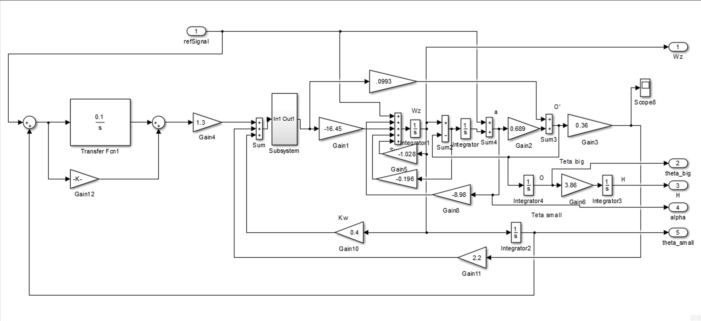

# 🚀 Интеграция Simulink модели в Python

> **Для кого этот репозиторий?**
> Для всех, кто хочет использовать модели, созданные в MATLAB Simulink, напрямую в Python-коде без необходимости запускать MATLAB.

## 📖 Что это такое?

Этот репозиторий содержит **рабочий пример** того, как взять модель из Simulink и использовать её в Python. 

### 🎯 Что делает наша модель?

Наша Simulink модель — это **упрощённая модель динамики летательного аппарата** (самолёта). Она рассчитывает:

| Параметр | Описание | Единицы |
|----------|----------|---------|
| `Wz` | Угловая скорость по оси Z | рад/с |
| `theta_big` (Θ) | Угол тангажа (наклон носа вверх/вниз) | рад |
| `H` | Высота полёта | м |
| `alpha` (α) | Угол атаки (угол между крылом и потоком воздуха) | рад |
| `theta_small` (θ) | Угол траектории | рад |

**Входной параметр:** `refSignal` — управляющий сигнал (желаемый угол атаки)



---

## 🔧 Как это работает? (Простым языком)

```
┌─────────────┐         ┌──────────────────┐         ┌─────────────┐
│  Simulink   │  ───►   │  C-код (.c/.h)   │  ───►   │ Библиотека  │
│   модель    │ Ctrl+B  │  (автогенерация) │   gcc   │    (.so)    │
│   (.slx)    │         │                  │         │             │
└─────────────┘         └──────────────────┘         └─────────────┘
                                                            │
                                                            ▼
                                                     ┌─────────────┐
                                                     │   Python    │
                                                     │  (ctypes)   │
                                                     └─────────────┘
```

### Пошаговое объяснение:

1. **Simulink модель (.slx)** — графическая модель вашей системы
2. **Ctrl+B** — генерирует C-код из модели
3. **gcc** — компилирует C-код в динамическую библиотеку (.so на Linux/Mac, .dll на Windows)
4. **Python + ctypes** — загружает библиотеку и вызывает функции модели

---

## 📁 Структура проекта

```
simulink-example/
│
├── 📄 README.md                 # Этот файл с документацией
├── 📓 example_your_sim.ipynb    # Jupyter notebook с примером использования
├── 📋 requirements.txt          # Зависимости Python (pip install -r requirements.txt)
├── 📜 LICENSE                   # MIT лицензия
│
├── 🎨 model.slx                 # Исходная Simulink модель
├── 🖼️ model.png                 # Картинка модели
├── 📦 model.so                  # Скомпилированная библиотека (готова к использованию!)
│
├── 🐍 rtwtypes.py               # Python-типы для работы с Simulink типами данных
│
└── 📂 model_ert_shrlib_rtw/     # Сгенерированный C-код
    ├── model.c                  # Основной код модели (алгоритмы расчёта)
    ├── model.h                  # Заголовочный файл (описание структур данных)
    └── ...                      # Вспомогательные файлы
```

---

## 🚀 Быстрый старт

### Требования

| Компонент | Версия | Обязательно |
|-----------|--------|-------------|
| **Python** | 3.8+ | ✅ Да |
| matplotlib | 3.5+ | ✅ Да |
| Jupyter Notebook | 6.4+ | ⚪ Опционально |
| GCC (для перекомпиляции) | любая | ⚪ Опционально |

> 💡 **Рекомендуемая версия Python: 3.10+**
> 
> Проект тестировался на Python 3.8, 3.9, 3.10, 3.11, 3.12

### Установка зависимостей

```bash
# Клонируем репозиторий
git clone https://github.com/your-username/simulink-example.git
cd simulink-example

# Устанавливаем зависимости
pip install -r requirements.txt
```

### Запуск примера

1. Откройте `example_your_sim.ipynb` в Jupyter Notebook
2. Запустите все ячейки последовательно
3. Наблюдайте графики динамики летательного аппарата!

---

## 📚 Подробное руководство: Как создать свою интеграцию

### Шаг 1: Подготовка Simulink модели

В вашей Simulink модели добавьте специальные блоки для определения входов и выходов:

```
┌─────────────────────────────────────────────────────────────┐
│                     Ваша Simulink модель                    │
│                                                             │
│   [In1] ────►  ┌─────────────────────┐  ────► [Out1]       │
│   (вход)       │  Ваша логика/       │        (выход 1)    │
│                │  передаточные       │                      │
│                │  функции/блоки      │  ────► [Out2]       │
│                └─────────────────────┘        (выход 2)    │
│                                                             │
└─────────────────────────────────────────────────────────────┘
```

**Важно:** Именно блоки `In1` и `Out1` станут входными и выходными параметрами вашей модели!

### Шаг 2: Настройка генерации кода

1. Откройте настройки модели: **Model Settings** → **Code Generation**
2. Найдите параметр **System target file**
3. Выберите: `ert_shrlib.tlc`

   > 💡 `ert_shrlib` означает "Embedded Real-Time Shared Library" — 
   > это шаблон для генерации кода, который можно использовать как динамическую библиотеку.

### Шаг 3: Генерация C-кода

Нажмите `Ctrl+B` (или меню **Code** → **C/C++ Code** → **Build Model**)

После этого появится папка `MODEL_NAME_ert_shrlib_rtw/` с сгенерированным кодом.

### Шаг 4: Компиляция в динамическую библиотеку

Откройте терминал, перейдите в папку с кодом и выполните:

```bash
# Для Linux/Mac:
cd MODEL_NAME_ert_shrlib_rtw
gcc -shared -o model.so -fPIC *.c

# Для Windows:
# gcc -shared -o model.dll *.c
```

> 📝 **Что означают флаги?**
> - `-shared` — создать динамическую библиотеку
> - `-o model.so` — имя выходного файла
> - `-fPIC` — Position Independent Code (нужно для библиотек)
> - `*.c` — скомпилировать все .c файлы

### Шаг 5: Определение интерфейса в Python

Откройте сгенерированный файл `MODEL_NAME.h` и найдите структуры `ExtU_` и `ExtY_`:

```c
/* В файле model.h найдите: */

/* External inputs - это ВХОДЫ вашей модели */
typedef struct {
  real_T refSignal;     /* '<Root>/refSignal' */
} ExtU_model_T;

/* External outputs - это ВЫХОДЫ вашей модели */
typedef struct {
  real_T Wz;            /* '<Root>/Wz' */
  real_T theta_big;     /* '<Root>/theta_big' */
  real_T H;             /* '<Root>/H' */
  real_T alpha;         /* '<Root>/alpha' */
  real_T theta_small;   /* '<Root>/theta_small' */
} ExtY_model_T;
```

Теперь опишите эти структуры в Python:

```python
import ctypes
from rtwtypes import *  # Импортируем типы Simulink

# Выходные параметры (что модель рассчитывает)
class ExtY(ctypes.Structure):
    _fields_ = [
        ("Wz", real_T),          # Угловая скорость
        ("theta_big", real_T),   # Угол тангажа
        ("H", real_T),           # Высота
        ("alpha", real_T),       # Угол атаки
        ("theta_small", real_T), # Угол траектории
    ]

# Входные параметры (что вы задаёте модели)
class ExtU(ctypes.Structure):
    _fields_ = [
        ("ref_signal", real_T),  # Управляющий сигнал
    ]
```

> ⚠️ **ВАЖНО:** Порядок полей в `_fields_` должен ТОЧНО совпадать с порядком в C-структуре!

### Шаг 6: Использование модели

```python
import ctypes
import os

# 1. Загружаем библиотеку
dll = ctypes.cdll.LoadLibrary(os.path.abspath("model.so"))

# 2. Получаем доступ к входам и выходам
X = ExtU.in_dll(dll, 'model_U')  # Входы
Y = ExtY.in_dll(dll, 'model_Y')  # Выходы

# 3. Получаем функции модели
model_initialize = dll.model_initialize  # Инициализация
model_step = dll.model_step              # Один шаг расчёта
model_terminate = dll.model_terminate    # Завершение

# 4. Запускаем симуляцию
model_initialize()  # Инициализируем модель

results = []
for step in range(1000):
    X.ref_signal = -0.1        # Задаём вход
    model_step()               # Делаем шаг симуляции
    results.append(Y.Wz)       # Сохраняем выход

model_terminate()  # Освобождаем ресурсы
```

---

## 🔑 Три главные функции модели

| Функция | Описание | Когда вызывать |
|---------|----------|----------------|
| `model_initialize()` | Инициализирует все переменные модели начальными значениями | **Один раз** в начале |
| `model_step()` | Рассчитывает один шаг модели (dt секунд) | **На каждом шаге** симуляции |
| `model_terminate()` | Освобождает ресурсы | **Один раз** в конце |

> 💡 **Шаг времени (dt)** задаётся в настройках Simulink модели. В нашем примере dt = 0.1 секунды.

---

## 📊 Соответствие типов: Simulink → C → Python

| Simulink/C тип | Описание | Python (ctypes) |
|----------------|----------|-----------------|
| `real_T` / `real64_T` | 64-бит число с плавающей точкой | `ctypes.c_double` |
| `real32_T` | 32-бит число с плавающей точкой | `ctypes.c_float` |
| `int32_T` | 32-бит целое со знаком | `ctypes.c_int` |
| `uint32_T` | 32-бит целое без знака | `ctypes.c_uint` |
| `int16_T` | 16-бит целое со знаком | `ctypes.c_short` |
| `boolean_T` | Булево значение | `ctypes.c_ubyte` |

Полный список типов находится в файле `rtwtypes.py`.

---

## ❓ Частые вопросы (FAQ)

### Почему мне нужно описывать структуры в Python, если они уже есть в C?

Python и C — разные языки. Python не может автоматически "понять" структуры из C-кода. Модуль `ctypes` позволяет нам "научить" Python работать с памятью так же, как это делает C. Поэтому структуры нужно описать заново.

### Что если у меня несколько входов/выходов?

Просто добавьте больше полей в структуры `ExtU` и `ExtY`. Главное — сохранить порядок как в `.h` файле.

### Можно ли изменять входы между шагами?

Да! Именно так и работает симуляция. Вы можете менять `X.ref_signal` на каждом шаге для имитации изменяющегося управляющего воздействия.

### Почему `.so` файл не работает на Windows?

На Windows используются файлы `.dll`. Перекомпилируйте код с помощью:
```bash
gcc -shared -o model.dll *.c
```

### Нужен ли мне MATLAB для использования модели?

**Нет!** После компиляции в `.so`/`.dll` файл, MATLAB больше не нужен. Python работает с библиотекой напрямую.

---

## 📝 Лицензия

MIT License — используйте как хотите!

---

## 🤝 Вопросы и предложения

Если что-то непонятно — создайте Issue в репозитории!
